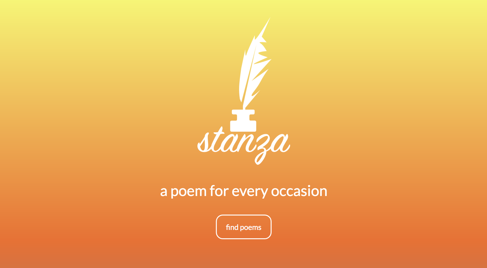
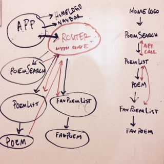

# Stanza - Poetry Finder
##### Robin Sola // June 2018
---

### Description
An application to find poems, using [PoetryDB API](https://github.com/thundercomb/poetrydb) and [POEMIST API](https://poemist.github.io/poemist-apidoc/). Choose from a list of topics by holiday, theme, occasion, and refine your search by adding an author. User may also choose to generate a random poem from the database. Save, store, collect your favorite poems for easy access. The goal is for the user to be able to use this easy poetry finder as a quick reference for inspiration in a situation where they are put on the spot to express themselves, give a short speech, or write a greeting in a card.

### MVP
* App will collect user input - selection of Holiday or theme, or submit author or keyword search.
* App will collect poems from the Poetry Database to display a list poems based on user search results - showing title, author, and poem content.

### Stretch Goals
* User will be able to generate a random poem from the database.
* User will be able to save and store favorite poems in a separate list.
* User will be able to log when, where, who with, and how many times they have used each of their saved poems in the wild (real world).
* User will be able to save and store a list of favorite authors to click on for quick access to a list of their poems.

### Brainstorming
mood:
* sleek, sexy-fresh, simple
* stanza, versify, versifier, sonnet, couplet, limerick

content & navigation:
* Logo / login form / register (probably won't have a user login)
* Nav bar: search / random poem / favorites
* Search form: theme: text / occasion: dropdown / author: text
* Poem marketplace: number of poems in search, list of poems with title / author / teaser
* Poem detail: title / author / lines / button to add to favorites / btn back to search results

icons:
* logo: ink bottle with feather pen
* search: magnify glass
* generate random poem: two arrows / shuffle icon
* list of favorites: heart with 3 lines / double hearts
* add to favorites: heart

colors:
* yellow / orange gradient
* white rgb(255, 255, 255)-#ffffff
* black rgb(0, 0, 0)-#000000
* drk gray rgb(58, 58, 58)-#3a3a3a
* lite gray rgb(109, 109, 109)-#6d6d6d

fonts:
* Lato, sans-serif (use for content)
* Dancing Script, cursive
* Sign Painter, cursive (use for logo)
* News Cycle, sans-serif
* Special Elite, cursive

### Planning / NOTES
*PoemSearch generates PoemList through API call*
1. Break up application into components:
App, LogoSplash, NavBar, PoemSearch, PoemList, Poem, FavPoemList, FavePoem
2. Create static UI without interactivity - passing data using props
3. Identify minimal, complete representation of state: App will be stateful because of its hierarchy: PoemList needs to fill with poems based on SearchPoems form submit
4. PoemList is changeable state that will be stored in App, making App stateful
5. Inverse data flow: Poem in PoemList will be filtered by click event to move Poem to new FavPoemList

*Below is a rough sketch of the component tree with a stateful router*

### Installation
* Clone project folder in terminal: `$ git clone` repository url (https://github.com/robinsola/Stanza-React)
* In terminal, run `$ cd Stanza-React` to get inside project directory
* In terminal, run `$ npm install` in project folder home directory
* In terminal, run `$ npm start` in project folder home directory

### Known Bugs
Project in Progress

### Technologies and Resources
* React / Redux
* JavaScript / JSX
* CSS
* HTML
* npm / webpack
* Sketch
* API call to PoetryDB

This project was bootstrapped with [Create React App](https://github.com/facebookincubator/create-react-app).

### License
##### Copyright (c) 2018 Robin Sola.
Permission is hereby granted, free of charge, to any person obtaining a copy of this software and associated documentation files (the "Software"), to deal in the Software without restriction, including without limitation the rights to use, copy, modify, merge, publish, distribute, sublicense, and/or sell copies of the Software, and to permit persons to whom the Software is furnished to do so, subject to the following conditions:

The above copyright notice and this permission notice shall be included in all copies or substantial portions of the Software.

THE SOFTWARE IS PROVIDED "AS IS", WITHOUT WARRANTY OF ANY KIND, EXPRESS OR IMPLIED, INCLUDING BUT NOT LIMITED TO THE WARRANTIES OF MERCHANTABILITY, FITNESS FOR A PARTICULAR PURPOSE AND NONINFRINGEMENT. IN NO EVENT SHALL THE AUTHORS OR COPYRIGHT HOLDERS BE LIABLE FOR ANY CLAIM, DAMAGES OR OTHER LIABILITY, WHETHER IN AN ACTION OF CONTRACT, TORT OR OTHERWISE, ARISING FROM, OUT OF OR IN CONNECTION WITH THE SOFTWARE OR THE USE OR OTHER DEALINGS IN THE SOFTWARE.
